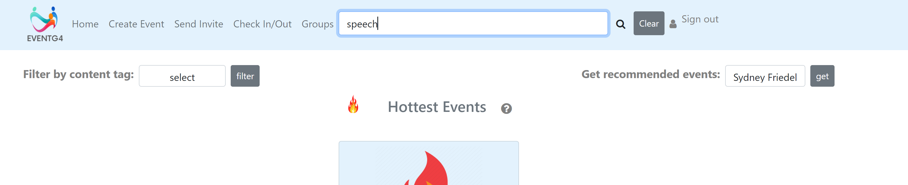

# 2021-fall-group-group4

# EventApp: A Summary

    EventApp is a platform for creating, managing, discovering, and attending
    events on campus. It's a one-stop app where users can create profiles, post about their events, and search for &
    be recommended events based on popularity and individual user interests. In addition, the app will serve 
    as a check-in/check-out mechanism for events, management system for event attendence, and more.

# Built With
    IntelliJ
    ORMLite
    JDBC
    SparkJava
    Velocity Template Engine
    JQuery
    Bootstrap
    Collaboration Platform: Github
    Login Functionality: Google Sign-in
    Deployment: Heroku
    Mail API: JavaMail

# Getting Started

### Prerequisites and Dependencies
    Project dependencies: JUnit 5.6.0, ORMLite 5.6, Spark Java 2.9.3, JDBC 3.36.02, Spark Template Velocity 2.7.1, GoogleCode 1.1.1, Java Mail API 1.6.2, OkHttp       4.9.1, SQLite 3.36.0.2, Simple Logging Facade for Java (API & Simple) 1.7.32
    Clone the repo (enter in cmd line): git clone https://github.com/jhu-oose/2021-fall-group-group4.git

### Usage of EventApp
 To get a local copy up and running follow these simple steps.
    1. After cloning the repository, make sure your IDE is configured to run the gradle package and is using Java 8
    2. Run the Server class (In Project/src/java)
    3. In your browser, go to localhost:7000 to access the web app
 To access the deployed version of our app, follow these simple steps.
    1. In your browser, visit  https://group4-eventapp.herokuapp.com/
    2. You will need to sign in using your Google account. If you do not have a google account, you must create one. Afterwards, you'll be redirected to the app's     homepage, which is the main feed of all events.
    
#### How to end 
    1. Finish whatever feature you're using on the web app
    2. (If running locally) Close out of the web app (localhost 7000 browser) and end the Server locally (you must end the server locally, closing out the web app is not enough)
    3. (If using the deployed version) Simply close out of your browser.
    
# Roadmap (Currently Implemented Features)
    View all current events in a general feed, which can be searched/filtered based on event title and description or associated content tags.
    Add a new event (seminar or social event) and store details such as date, address, host, and optional content tags.
    Check into/out of a currently occuring event (to mark attendance).
    Be reccomended an event based on individual user interests.
    Be reccomended an event based on the event's 'hotness' (popularity) and as a function of the user's distance to the event.
    Create a new user profile and supply details like name, email, and optional user interests (happends automatically upon login).
    Edit your interests after having created your profile (interests can be updated at any time).
    Create and delete groups and add individual users to these groups.
    Invite other individual users to an event (which will send an invite over email to the user).
    Auto-invite all users to newly-created public events.
    Check into a currently occuring event (select the given event from a drop down of events, then select the individual who will be checking in). Note: Only users who have been invited to an event will see there name listed once that event has been selected.
    See how many people are currently at an event and how this compares to the event's capacity.
    
# Example of App Usage Flow
    1. Visit https://group4-eventapp.herokuapp.com/. You will be met with the login screen, which will direct you to sign-in with your Google email/password. If this is your first time logging in, an individual profile will automatically be created for you based on your name and email.

    2. Upon login, you will be redirected to the app's homepage, which contains your main event feed. At the top of the page is the navigation bar, which you can use to take you to the other pages of the app. Here, all public events and all private events that you've been invited to will be shown. The current hottest event will be displayed at the top of the screen.

        You can filter your event feed by using the search bar to search for keywords in event titles and descriptions. Hit 'clear' to restore your feed back to its full state.

        Another way to filter events is by selecting a content tag from the provided drop-down. After you hit 'filter', you'll be shown a list of all events (if any) with that content tag attached to them.

    3. If this is your first time logging in, you can navigate to the profile page (the person icon on the navbar) to set your interests. Simply select up to 3 content tags to attach to your profile. These tags allow you to personalize your profile and allow us to recommend events to you based off your interests.

        If this isn't your first time logging in, you can still use the same "edit tags" functionality to change your associated interests at any point in time.

        Once you have set your interests, you can navigate back to the event feed (the Home page) to be recommended an event based on your interest. Simply hit the 'Get Recommendations' button to be redirected to a screen with all the events we think you'd like (these are all events that have content tags aligning with your interests).

    4. To create an event, navigate to the Create Event page. Here, you can fill out a form to supply the details of your event, including its title, description, address, whether or not it's private, and up to 3 associated content tags. First, select the type of event you want to create (currently, seminars and social events are your two options), to be met with the unique form for that event type. Then, fill out the form and hit 'Create'. You can navigate back to the home screen to see your newly added event.

        If you made your event public, all users of the app will be able to see it on their feed. If your event is private, you'll need to invite other users to it. Navigate to the 'Invite' page, select the event you're inviting people to from the drop-down, and the individual you want to invite from the other drop-down. Hitting the 'invite' button will automatically send an email to the person you're inviting with the event details. 

    5. To check into/out of currently occuring events, head to the 'Check-In/Out' page. To check-in, simply select the ongoing event from the drop down and hit 'check-in' to mark your arrival (note: you will only be able to check into events you've been invited to, i.e. all public events and private events that the host has invited you to).

        To check out of an event you're currently at, select the event from the check-out drop down and hit check-out.

        At any point in time, you'll be able to see how many people are currently at an event on each event card on your main feed.

    6. If you're part of a campus group and would like them to be associated with EventG4, navigate to the 'Groups' page. Here, you can simply enter the name of your group and hit 'Add Group' to create it. Next, you'll see your group displayed on the list of all EventG4's registered groups. You can click the blue button to view the members of every group.

        For the groups you've created, you can add members by hitting the green button and selecting the individual you're adding from the drop-down.

        In addition, you can hit the red button to delete any groups you've created. 

        Once you create a group, you can associate them with any future events you create (when you go to create your next event, select your desired group as the optional group representing group for the event).

    7. Once you're done using the app, you can either just close out of your browser or hit the 'Sign Out' button in the top right corner. Thanks for using EventG4!

    

    
